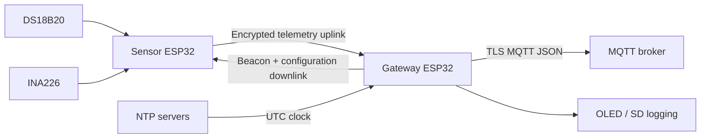
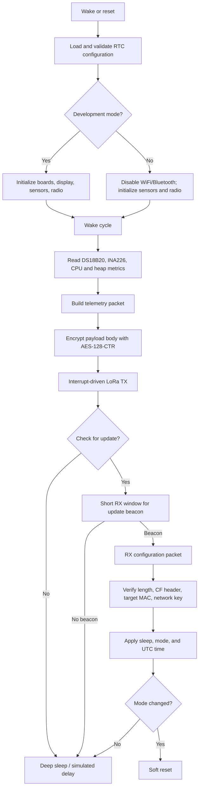
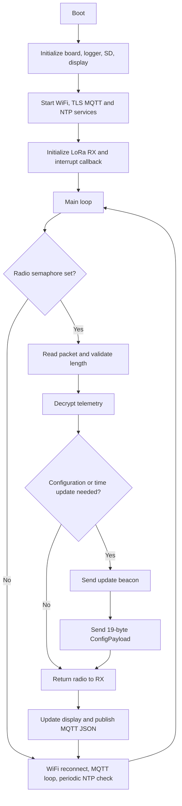
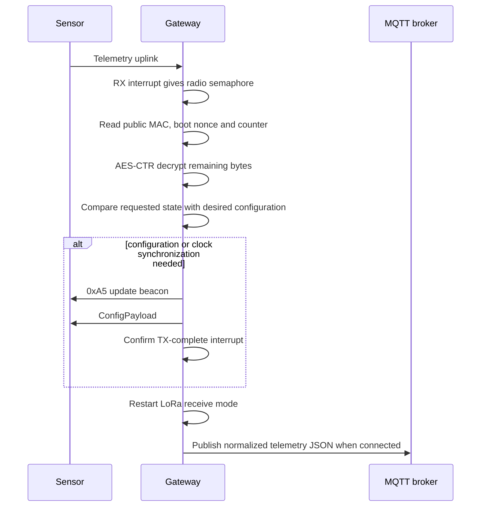

# Firmware Guide

This document describes the two ESP32 firmware images that make up LoRaHome. Build selection is controlled by `src_dir` in `platformio.ini`:

- `modes/Sensor/main.cpp` builds the battery-operated sensor.
- `modes/GateWay/main.cpp` builds the always-on gateway.

Both images use the shared packed payload definitions in `lib/LoraHomeCommon/src/LoraHomeCommon.h`. A Sensor and Gateway must use the same payload version.

## System overview



## Sensor firmware

### Responsibilities

The Sensor samples the boiler temperature and battery condition, transmits compact telemetry, briefly listens for a configuration response when needed, then sleeps. It is designed to spend almost all of its time in deep sleep.

It supports two modes:

- **Operation mode:** performs one wake cycle in `setup()` and enters ESP32 deep sleep. `loop()` is not reached.
- **Development mode:** does not deep sleep. `loop()` delays for the configured interval, runs the same wake cycle, and refreshes the display. It can be enabled with GPIO13 held LOW or remotely with configuration.

### Sensor architecture



### Sensor wake-cycle workflow

```mermaid
sequenceDiagram
    participant S as Sensor
    participant R as Sensor LoRa radio
    participant G as Gateway

    S->>S: Read sensors and RTC
    S->>S: Build 20-byte normal or 31-byte dev telemetry
    S->>R: startTransmit()
    R-->>G: Telemetry uplink
    R-->>S: TX-complete interrupt
    Note over S,G: Sensor enters RX; Gateway waits 50 ms for radio turnaround
    S->>S: Increment wake-cycle count
    alt tenth cycle or time is invalid
        S->>R: startReceive() for beacon window
        G-->>R: 0xA5 update beacon
        R-->>S: RX-complete interrupt
        S->>R: startReceive() for configuration window
        G-->>R: 19-byte ConfigPayload
        R-->>S: RX-complete interrupt
        S->>S: Validate and apply configuration
    end
    S->>S: Deep sleep, or simulate sleep in development mode
```

### Sensor state and persistence

- `rtcConfig` uses `RTC_NOINIT_ATTR`, so the accepted sleep interval and remote development-mode setting survive soft resets and deep sleep.
- `counter`, `wakeCycleCount`, and `bootNonce` use RTC memory. `bootNonce` is generated with `esp_random()` on a cold boot and retained through deep sleep.
- A configuration update resets `wakeCycleCount`; otherwise the Sensor checks for an update every ten wake cycles.
- The Sensor treats the RTC as unsynchronized until it differs from the expected boot epoch progression. A valid downlink `timeOffset` sets the ESP32 system clock in UTC.
- Sensor serial diagnostics are prefixed with UTC (`YYYY-MM-DDTHH:MM:SSZ`) after synchronization, or elapsed boot time (`+<seconds>s`) beforehand.

## Gateway firmware

### Responsibilities

The Gateway continuously receives LoRa telemetry, answers configuration requests, maintains WiFi/MQTT/NTP services, publishes telemetry as JSON, writes asynchronous logs, and updates the display.

Radio work is handled first in `loop()`. This is intentional: a sleeping Sensor has a limited response window, while MQTT reconnection and NTP maintenance can take longer.

### Gateway architecture



### Gateway receive-and-reply workflow



### Network, time, logging, and display

- WiFi uses station mode; MQTT uses `WiFiClientSecure` and `PubSubClient` on the configured TLS port.
- The Gateway requests NTP time in the configured Athens timezone. UTC timestamps are sent to Sensors as seconds relative to `CUSTOM_EPOCH` (2024-01-01 UTC).
- MQTT publication is split by sensor mode: normal data goes to `lorahome/sensor/<mac>/data`; development telemetry goes to `lorahome/sensor/<mac>/telemetry`; online gateway status uses `lorahome/gateway/status`.
- Both valid telemetry sizes enter the core-data MQTT path; only the 31-byte development packet also produces the development-metrics publication.
- The OLED alternates between current sensor data and gateway status. Logging is configured through Elog and may be sent to serial and SD storage.

## Radio protocol

### Interrupt handling

Both firmware images register RadioLib packet-sent and packet-received callbacks. The ISR does not parse radio data; it only releases a FreeRTOS binary semaphore. Normal task context then calls `readData()`, performs cryptography, and changes radio mode safely.

### Telemetry payload

`TelemetryPayload` is packed and is either 20 bytes (normal) or 31 bytes (development):

| Area | Fields | Encryption |
| --- | --- | --- |
| Public nonce material | `mac` (6), `bootNonce` (4), `msgCount` (2) | Not encrypted |
| Core telemetry | Temperature, voltage, percentage, mode, time-sync state, sleep interval | AES-128-CTR |
| Development telemetry | Current, power, free RAM, CPU temperature, TX power, last downlink SNR/RSSI | AES-128-CTR; development packets only |

The CTR nonce is constructed from the MAC, boot nonce, and message count. The Gateway reads those public fields before decrypting the remainder. The boot nonce prevents a cold boot from reusing a keystream with the same Sensor counter.

### Configuration payload

`ConfigPayload` is a packed 19-byte downlink:

| Field | Bytes | Meaning |
| --- | ---: | --- |
| `header` | 2 | `CF`, quick packet discriminator |
| `targetMac` | 6 | Sensor MAC or all `FF` for broadcast |
| `networkKey` | 4 | Shared configuration authorization value |
| `sleepInterval` | 1 | Requested sleep duration in seconds |
| `configVersion` | 1 | Protocol configuration version; currently `1` |
| `isDevMode` | 1 | Nonzero enables development mode |
| `timeOffset` | 4 | Seconds since `CUSTOM_EPOCH`; zero means no clock update |

The Sensor accepts a configuration only after checking its exact length, `CF` header, target MAC/broadcast MAC, and `NETWORK_KEY`.

## Build and deployment

1. Select exactly one `src_dir` in `platformio.ini`.
2. Build with `platformio run -e T3_V1_6_SX1276`.
3. Flash the Gateway and Sensor as a matched pair whenever the shared payload layout changes.
4. Keep secrets in `secrets.h`; do not commit credentials or key material.

The host-side protocol tests in `test/` mirror the packet sizes and serialization behavior. Update them whenever the shared wire format changes.
